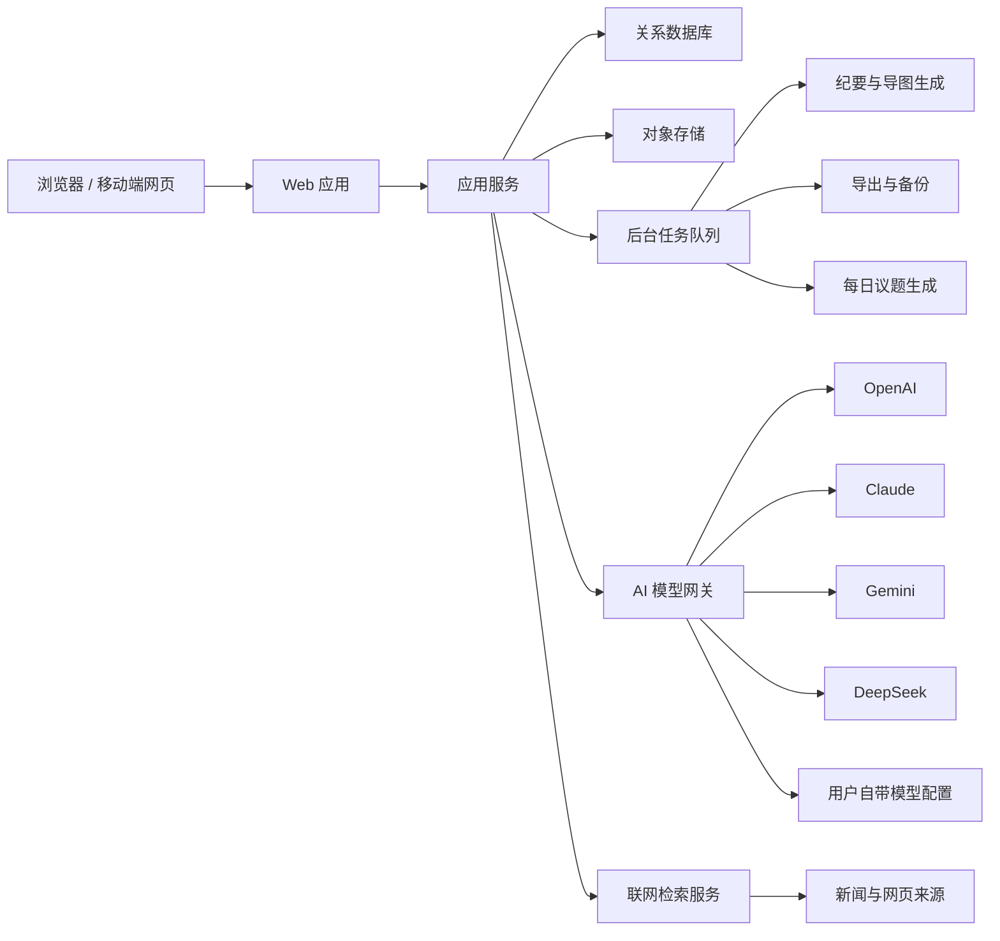
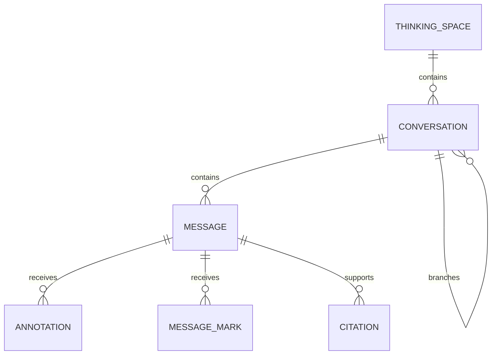

# 思屿产品设计：完整会话存档

- 导出时间：2026-08-12T15:58:21+08:00
- 原任务 ID：`019ff695-ada0-7162-b5a4-982abe5b4722`
- 用途：下次新建任务时导入，恢复本次产品设计上下文。

> 导入提示：请读取本文件及文末关联文件，恢复上下文后继续工作。不要重新询问已经确认的产品决策。

## 隐私说明

本存档仅包含用户可见消息和助手回复，不包含系统/开发者指令、隐藏推理、工具调用详情或凭据。

## 已确认决策

- 个人优先，架构支持未来多用户
- 平台模型 + 用户自带 API Key 的混合接入；第一期平台统一接入
- 每日议题包含热点、个性化、随机思想题，并支持自建议题
- 记录可读推理摘要与观点演变，不展示模型隐藏思维链
- 会话旁注与独立感思并存，历史分析需用户授权
- 云端加密同步 + 本地草稿/备份 + 完整删除
- 第一期优先 Markdown/PDF/JSON；Word/PNG/SVG 后续
- 采用思考工作台型方案，分两期建设，当前不做社区

## 完整对话

### 1. 用户

我想做一个网站，里面是一个记录我和AI对话并且可以记录我的感思的网站，这个网站可以在联网的情况下帮我每天自动提供一个讨论议题可供选择，也可以我自己写议题，然后我可以选择模型对话，对话内容可以记录，并帮我生成一个纪要，包括思考过程对话重点，和思维导图等，我可以导出

### 2. 助手（进度说明）

我会先把你的想法整理成一个可运行的产品原型：围绕“每日议题 → 选择模型深聊 → 自动沉淀纪要/思维导图 → 导出”这条主线来设计。为了让界面和交互真正好用，我会先用产品构思与前端应用构建两套方法梳理需求，再检查当前项目并直接实现。

### 3. 用户

我想做一个网站，里面是一个记录我和AI对话并且可以记录我的感思的网站，这个网站可以在联网的情况下帮我每天自动提供一个讨论议题可供选择，也可以我自己写议题，然后我可以选择模型对话，对话内容可以记录，并帮我生成一个纪要，包括思考过程对话重点，和思维导图等，我可以导出，帮我根据这个需求整理一个详细的设计文档[@superpowers](plugin://superpowers@openai-curated-remote)

### 4. 助手（进度说明）

我会按你指定的 Superpowers 方法来做：先检查当前项目背景，再逐步确认产品边界；之后给出 2–3 种方案和推荐设计，待你确认后，把完整设计文档写入项目并做一致性审查。这个方法要求在正式落文档前逐项获得你的确认，所以我会一次只问一个关键问题。

### 5. 助手

当前目录里没有可沿用的项目内容，因此我会把它作为一个全新产品来设计。

第一个关键问题：你希望第一版主要服务于哪种使用场景？

A. **个人私密使用**：只有你自己使用，重点是长期记录、搜索、回顾与隐私  
B. **多用户产品**：任何人都能注册使用，各自保存对话和感思  
C. **先个人使用，架构支持以后开放注册**：第一版保持简单，但为多用户扩展留好空间

我建议选 **C**，既能尽快做出第一版，也不会限制未来产品化。

### 6. 用户

c

### 7. 助手

好的，第一版定位为：**个人优先使用，同时为未来开放注册和多用户扩展预留架构**。

第二个关键问题：你希望第一版如何接入 AI 模型？

A. **平台统一接入**：网站统一配置 OpenAI、Claude、Gemini、DeepSeek 等模型，用户直接选择  
B. **用户填写自己的 API Key**：成本由用户承担，但配置门槛和安全要求较高  
C. **混合模式**：默认提供平台模型，同时允许高级用户配置自己的 API Key

我建议选 **C**，但第一阶段先实现平台统一接入，个人 API Key 作为后续扩展。

### 8. 用户

c

### 9. 助手

明白，采用**混合模型接入模式**：

- 默认使用平台提供的模型；
- 后续允许用户安全配置自己的 API Key；
- 对话时可选择不同厂商和具体模型；
- 数据结构不与单一 AI 厂商绑定。

第三个关键问题：你希望“每日议题”主要如何产生？

A. **联网热点型**：基于当天新闻、科技、社会与文化热点生成，并附信息来源  
B. **个人成长型**：根据你的历史对话、兴趣和反思方向个性化生成  
C. **混合型**：每天同时提供热点议题、个性化议题和一个随机思想议题，也可自行创建

我建议选 **C**，内容更丰富，也能避免每天的话题被新闻热点牵着走。

### 10. 用户

c

### 11. 助手

好，每日议题采用**混合推荐机制**：热点议题、个性化议题、随机思想议题各提供一个，同时支持手动创建。

第四个关键问题：对于“思考过程”，你希望网站记录哪一种内容？

A. **你的思考轨迹**：记录观点如何变化、关键疑问、证据、分歧和最终结论  
B. **AI 的内部推理过程**：展示模型生成答案时的完整内部思维链  
C. **可读的推理摘要**：记录你的思考轨迹，并让 AI 生成“采用了哪些理由、比较了哪些观点、如何得到结论”的摘要

我建议选择 **C**。它能保留真正有价值的推理脉络，同时不依赖模型不可稳定提供的内部思维链。

### 12. 用户

c

### 13. 助手

明白。“思考过程”将设计为**可读的推理摘要**，包括观点演变、关键疑问、证据依据、分歧、未解决问题和结论形成过程，不展示 AI 的隐藏内部思维链。

第五个关键问题：第一版最需要支持哪些导出形式？

A. **基础文档**：Markdown、PDF  
B. **完整知识包**：Markdown、PDF、Word，以及思维导图 PNG/SVG  
C. **可迁移数据**：在 B 的基础上增加 JSON，便于以后迁移、备份或接入其他工具

我建议选 **C**，其中第一版优先实现 Markdown、PDF 和 JSON，Word及图片格式可作为后续增强。

### 14. 用户

c

### 15. 助手

好的，采用**可迁移的完整导出方案**：

- 阅读与分享：Markdown、PDF、Word
- 思维导图：PNG、SVG
- 数据备份与迁移：JSON
- 第一版优先支持 Markdown、PDF、JSON

第六个关键问题：对话、感思和纪要的数据默认保存在哪里？

A. **云端加密存储**：多设备同步方便，适合未来开放注册  
B. **仅保存在本地设备**：隐私更强，但换设备和备份较麻烦  
C. **混合存储**：默认云端加密同步，同时支持本地导出、完整备份和删除账户数据

我建议选 **C**，能兼顾使用便利、数据自主权和未来多用户扩展。

### 16. 用户

c

### 17. 助手

确定采用**混合存储**：云端加密同步，并支持本地备份、完整导出和彻底删除个人数据。

第七个关键问题：你希望“感思记录”和 AI 对话如何结合？

A. **会话内随手记录**：对话过程中可随时写旁注、标记重点，结束后再补充感想  
B. **独立日记系统**：感思是单独的笔记，可关联一个或多个议题、会话和纪要  
C. **二者结合**：既能在对话中写旁注，也能建立独立感思；AI 可基于授权内容发现长期观点变化和主题关联

我建议选 **C**。这样既不会打断当下对话，也能逐渐形成属于你的个人思想档案。

### 18. 用户

c

### 19. 助手

好，“感思记录”采用**双层结构**：

- 对话中可以随手添加旁注、划重点和记录灵感；
- 可以创建独立感思，并关联多个议题、对话、纪要；
- AI 只有在用户授权后，才能分析历史内容，发现长期主题、观点变化和知识联系。

第八个关键问题：第一版产品的范围希望做到哪一层？

A. **核心 MVP**：议题推荐、自建议题、多模型对话、感思记录、AI 纪要、基础思维导图、Markdown/PDF/JSON 导出  
B. **完整个人知识库**：在 A 的基础上增加全文搜索、标签、双向关联、时间轴、观点演变和语义检索  
C. **完整社区产品**：在 B 的基础上增加公开分享、关注、评论、议题广场和协作讨论

我建议选择 **B**，但分两期交付：第一期先完成 A，第二期补充个人知识库能力；社区功能暂不进入当前设计范围。

### 20. 用户

可以

### 21. 助手

范围确定为：**完整个人知识库方向，分两期建设；当前不包含社区功能。**

我整理出三种产品方案：

### 方案一：对话工具型

以聊天页面为核心，议题、旁注、纪要和导出都围绕单次会话展开。

优点是开发快、学习成本低；不足是长期内容容易变成大量孤立的聊天记录，不利于形成个人思想体系。

### 方案二：思考工作台型（推荐）

首页提供每日议题和历史回顾；每个议题进入独立“思考空间”，其中包含 AI 对话、个人旁注、感思、参考资料、自动纪要和思维导图。所有内容再汇入个人知识库，通过标签、关联、搜索和时间轴组织。

优点是既保留自然的对话体验，又能把零散交流沉淀成结构化知识，最符合你的目标。复杂度适中，也适合分期建设。

### 方案三：知识图谱型

从一开始就以观点、人物、概念、证据和关系为核心，AI 对话只是知识采集入口。

长期分析能力最强，但第一版操作复杂、开发成本高，容易让“记录和思考”变成维护数据库。

我的建议是采用**方案二**，并吸收方案三的一部分底层设计：第一版界面保持简单，但数据结构提前支持议题、观点、标签和内容之间的关联。

如果你认可这个方向，我下一步会先给出第一部分设计：**产品定位、用户旅程和功能边界**。这套方案是否通过？

### 22. 用户

方案二，可以先给出设计文档

### 23. 助手

## 第一部分：产品定位、用户旅程与功能边界

### 1. 产品定位

暂定产品名：**思屿**

“思屿”是一款面向个人的 AI 深度思考与知识沉淀工具。它以“议题”为起点，把每日话题推荐、人与 AI 的多轮讨论、个人感思、结构化纪要、思维导图和长期知识回顾连接起来。

它解决的不是“如何再做一个聊天工具”，而是：

> 如何让一次 AI 对话不随聊天窗口消失，而是逐渐形成可检索、可关联、可回顾、可迁移的个人思想档案。

第一版优先服务个人用户，同时从账户、权限、模型配置和数据隔离层面支持未来扩展为多用户产品。

### 2. 核心设计原则

1. **以议题组织思考**

   每次讨论都归属于一个明确议题。对话、旁注、感思、资料、纪要和思维导图围绕议题聚合，避免内容散落。

2. **区分原始记录与 AI 生成内容**

   用户原文、AI 回复、个人旁注和 AI 生成的纪要必须清晰区分。AI 不得静默修改用户记录。

3. **保留观点演变，而不展示隐藏思维链**

   系统记录用户观点变化、关键理由、分歧、证据和未解决问题，生成可读的推理摘要，但不声称展示模型内部思维过程。

4. **用户拥有数据控制权**

   内容可以完整导出、备份和删除。用户决定哪些历史内容可以参与个性化推荐或长期分析。

5. **先完成思考闭环，再扩展知识网络**

   第一期确保“发现议题—展开讨论—记录感思—生成纪要—导出”的闭环；第二期再增加语义搜索、双向关联和观点演变分析。

### 3. 核心对象

产品以“思考空间”作为主要工作单位，每个思考空间对应一个议题。

一个思考空间包含：

- 议题标题与讨论引导；
- 议题来源和参考链接；
- 一次或多次 AI 会话；
- 用户在对话中的旁注和重点标记；
- 独立感思；
- AI 生成的结构化纪要；
- 思维导图；
- 标签及与其他内容的关联；
- 创建时间、更新时间和归档状态。

这样可以避免把“议题”和“一次聊天”强制绑定。例如，同一个“AI 是否会削弱人的独立思考”议题，可以分别与不同模型讨论，也可以隔几个月重新讨论并比较观点变化。

### 4. 主要用户旅程

#### 4.1 从每日议题开始

用户进入首页后看到三类推荐：

- **今日热点**：根据可靠的联网信息生成，并展示来源与更新时间；
- **为你推荐**：根据用户授权的兴趣、历史议题和未解决问题生成；
- **随机思想题**：不依赖热点的哲学、生活、科技或社会议题。

用户可以选择一个议题，也可以直接输入自己的议题。选中后，系统创建思考空间，并提供可编辑的讨论引导问题。

#### 4.2 选择模型并开始讨论

用户选择模型厂商、具体模型和对话方式，然后进入讨论页面。

讨论过程中可以：

- 发送文字消息；
- 随时添加私人旁注；
- 标记重要消息或段落；
- 将内容标记为观点、证据、疑问或结论；
- 切换模型开启新的会话分支；
- 保存尚未发送的个人想法；
- 查看议题来源，但不打断当前对话。

模型切换默认创建新分支，不让另一个模型假装继承其没有实际接收的上下文。用户可以主动选择是否携带已有对话摘要。

#### 4.3 结束讨论并生成纪要

用户点击“整理本次思考”后，系统生成可编辑纪要，包括：

- 议题与讨论背景；
- 用户的核心观点；
- 观点演变过程；
- 对话重点；
- 支持与反对理由；
- 使用过的证据和资料；
- 已形成的结论；
- 仍未解决的问题；
- 值得继续探索的方向；
- 思维导图。

生成结果必须引用对应的对话、旁注或资料位置。用户可以修改、重新生成某个部分，并确认最终版本。

#### 4.4 写下个人感思

用户既可以在对话中添加旁注，也可以创建独立感思。

独立感思可以关联：

- 一个或多个议题；
- 一次或多次对话；
- 某份纪要；
- 其他感思；
- 标签和外部资料。

用户可以选择“仅保存原文”或“请 AI 帮我整理”，但 AI 整理结果与原文分别保存，原文始终可恢复。

#### 4.5 回顾与导出

用户可以从知识库按关键词、标签、日期、议题状态或模型筛选内容，并查看个人思考时间轴。

单个思考空间或选定内容可以导出为：

- Markdown；
- PDF；
- JSON；
- 后续扩展 Word；
- 思维导图 PNG 或 SVG。

JSON 导出保留内容之间的关联关系，确保未来能够迁移或重新导入。

### 5. 产品功能边界

#### 第一期：核心 MVP

第一期必须完成：

- 账户与个人数据空间；
- 每日三类议题推荐；
- 自定义议题；
- 多模型选择及流式对话；
- 对话保存与历史恢复；
- 对话旁注、重点标记；
- 独立感思及内容关联；
- 结构化纪要生成与编辑；
- 基础思维导图；
- 关键词和标签检索；
- Markdown、PDF、JSON 导出；
- 云端同步、本地备份和数据删除；
- 模型使用量及费用提示；
- 联网内容的来源展示。

#### 第二期：个人知识库增强

第二期增加：

- 全文与语义混合搜索；
- 双向链接和关联推荐；
- 思考时间轴；
- 跨议题观点聚合；
- 观点演变分析；
- 相似或矛盾观点提醒；
- 自带 API Key；
- Word、PNG、SVG 等增强导出；
- 更完善的资料收藏与引用；
- 多设备离线缓存和同步冲突处理。

#### 当前明确不做

为控制第一版范围，暂不包含：

- 公开社区和议题广场；
- 关注、评论、点赞；
- 多人实时协作；
- AI 数字人或语音通话；
- 自动替用户发布内容；
- 复杂的知识图谱编辑器；
- 模型训练或微调；
- 将 AI 生成内容冒充为用户观点。

### 6. 成功标准

第一版上线后，用以下指标判断产品是否真正有价值：

- 用户能在三步内开始一个议题讨论；
- 对话和旁注能够自动保存，不因刷新而丢失；
- 用户完成讨论后能在一分钟内得到结构化纪要；
- 纪要中的重点能够回溯到原始内容；
- 用户可以完整导出一个思考空间；
- 用户能够在知识库中重新找到过去的讨论；
- 删除账户后，个人内容按规则彻底清除；
- 即使某个模型或联网服务不可用，用户仍能访问已有记录和撰写感思。

这一部分确定了产品的核心：**它首先是个人思考工作台，其次才是 AI 聊天工具。**

请确认这部分是否符合你的设想。确认后，我会继续提交第二部分：**信息架构、页面结构与关键交互设计**。

### 24. 用户

符合

### 25. 助手

## 第二部分：信息架构、页面结构与关键交互

### 1. 整体信息架构

网站分为六个一级区域：

1. **今日**
   - 每日议题推荐
   - 快速创建议题
   - 最近进行中的思考
   - 待继续的问题
   - 历史回顾

2. **思考空间**
   - 议题概览
   - AI 对话
   - 旁注与重点
   - 参考资料
   - 独立感思
   - 纪要
   - 思维导图

3. **知识库**
   - 全部内容
   - 议题
   - 对话
   - 感思
   - 纪要
   - 标签
   - 收藏与归档
   - 搜索结果

4. **回顾**
   - 思考时间轴
   - 近期主题
   - 未解决问题
   - 观点变化
   - 周度或月度回顾

5. **导出与备份**
   - 单项导出
   - 批量导出
   - 完整数据备份
   - 历史导出任务
   - 数据恢复

6. **设置**
   - 个人资料
   - AI 模型
   - API Key
   - 个性化授权
   - 隐私与数据
   - 联网搜索偏好
   - 导出偏好
   - 用量与费用

第一期导航只突出“今日、知识库、回顾”三个主要入口。“导出与备份”和“设置”放入个人菜单，降低界面复杂度。

---

### 2. 全局页面框架

桌面端采用三层结构：

- 左侧为固定主导航；
- 中间为当前页面的主要工作区域；
- 右侧为按需出现的上下文面板。

右侧面板根据场景显示不同内容：

- 对话时显示旁注、重点和资料；
- 阅读纪要时显示原文引用；
- 浏览知识库时显示标签和关联内容；
- 查看思维导图时显示节点详情。

移动端改为：

- 底部主导航；
- 单列内容；
- 旁注、模型选择和资料以抽屉形式打开；
- 对话输入框固定在底部；
- 纪要与思维导图独立全屏显示。

页面应尽量减少层层卡片，主要内容使用开放式编辑区域、列表和分栏，突出阅读与思考。

---

### 3. “今日”首页

首页是每天打开产品后的起点，不设计为数据仪表盘。

#### 3.1 顶部区域

显示：

- 日期和简短问候；
- “写下一个议题”主操作；
- 搜索入口；
- 当前同步状态。

不展示活跃天数、消息数量等容易制造压力的指标。

#### 3.2 每日三个议题

三个议题按来源分区呈现：

**今日热点**

- 议题标题；
- 为什么值得讨论；
- 2～4 个引导问题；
- 信息来源数量和更新时间；
- “查看背景”和“开始讨论”。

**为你推荐**

- 议题标题；
- 推荐原因；
- 关联的历史主题；
- 是否允许使用这些历史内容；
- “开始讨论”。

**随机思想题**

- 简洁问题；
- 可选的正反切入角度；
- “换一个”和“开始讨论”。

推荐结果每天自动生成一次。用户可以手动刷新某一类，但系统需要限制频率，避免无意义地反复生成。

#### 3.3 继续思考

每日议题下方显示最多三个条目：

- 最近未完成的思考空间；
- 尚未解决的问题；
- 一段时间未回顾的重要议题。

系统解释推荐原因，例如“你上次留下了两个未解决问题”，而不是只显示模糊的“猜你喜欢”。

---

### 4. 创建议题流程

点击“写下一个议题”后打开轻量创建面板。

#### 4.1 必填字段

- 议题标题。

#### 4.2 可选字段

- 自己为什么想讨论；
- 已有观点；
- 希望解决的问题；
- 标签；
- 参考链接或资料；
- 期望讨论深度；
- 是否允许 AI 联网补充背景。

#### 4.3 AI 辅助

用户输入一句话后，可以让 AI：

- 优化议题表述；
- 拆分过大的问题；
- 生成正反讨论角度；
- 给出引导问题；
- 判断问题中是否包含未经证实的事实前提。

所有 AI 修改都以建议形式出现，未经确认不覆盖用户原文。

创建成功后进入“议题准备页”，用户可以编辑讨论目标并选择模型，不强迫立即开始聊天。

---

### 5. 思考空间

思考空间是产品的核心页面。

#### 5.1 顶部信息栏

包含：

- 议题标题；
- 状态：未开始、讨论中、待整理、已沉淀、已归档；
- 标签；
- 收藏；
- 更多操作；
- 最后保存时间。

标题、标签和状态可直接编辑。

#### 5.2 内容导航

空间内设置五个视图：

1. **讨论**
2. **感思**
3. **资料**
4. **纪要**
5. **思维导图**

默认进入“讨论”，但用户再次打开时回到上次离开的视图。

---

### 6. AI 对话界面

#### 6.1 对话顶部

显示：

- 当前模型；
- 是否联网；
- 当前会话分支；
- 已使用上下文范围；
- 预计或实际用量。

切换模型时提供三个选择：

- 开启空白新分支；
- 携带当前对话的结构化摘要；
- 携带用户选中的消息。

默认采用“携带结构化摘要”，并明确展示将发送给新模型的内容。

#### 6.2 消息内容

每条消息提供以下操作：

- 添加旁注；
- 标记重点；
- 标记为观点、证据、疑问或结论；
- 引用到新消息；
- 加入纪要候选；
- 复制；
- 修改用户自己的消息后创建新分支。

AI 回复如果使用联网资料，应在对应段落附近展示引用编号，并在消息末尾列出来源、发布日期和访问时间。

#### 6.3 输入区

输入区支持：

- 多行文字；
- 草稿自动保存；
- 引用消息；
- 添加临时讨论指令；
- 开关联网搜索；
- 选择回答风格；
- 停止生成；
- 重新生成。

第一版暂不加入复杂的文件上传。可以先支持网页链接和纯文本资料，后续再扩展 PDF、图片及其他附件。

#### 6.4 旁注

旁注默认仅属于用户，不自动发送给 AI。

用户可以主动选择：

- 仅自己可见；
- 在下一条消息中发送；
- 允许生成纪要时使用；
- 永不参与 AI 分析。

这种设计避免用户随手记录的私人想法被默认纳入模型上下文。

---

### 7. 感思编辑器

“感思”视图包含两类内容：

- 对话中产生的旁注；
- 独立创建的长篇感思。

编辑器支持：

- 标题和正文；
- Markdown 快捷格式；
- 自动保存；
- 标签；
- 关联内容；
- 版本历史；
- AI 整理建议。

AI 可以提供：

- 梳理表达；
- 提炼问题；
- 寻找反例；
- 比较过去观点；
- 生成后续行动。

用户原文和 AI 整理稿分别保存。界面始终允许切换到未经修改的原始版本。

---

### 8. 纪要生成与编辑

用户点击“整理本次思考”后，先进入生成设置：

- 使用哪些对话分支；
- 是否包含旁注；
- 是否包含独立感思；
- 是否使用参考资料；
- 纪要长度；
- 输出语言；
- 是否生成思维导图。

生成期间可以继续浏览已有内容。完成后通知用户，不阻塞整个页面。

纪要编辑页采用左右分栏：

- 左侧为结构化纪要；
- 右侧为依据和引用。

点击某个结论或重点时，右侧定位到对应对话、旁注或资料。无法找到明确依据的 AI 总结必须标记为“综合推断”。

用户可以：

- 编辑任意段落；
- 锁定不希望重新生成的部分；
- 仅重新生成一个章节；
- 接受或拒绝 AI 修改；
- 保存多个纪要版本；
- 将某一版本标记为正式版本。

---

### 9. 思维导图

第一版采用自动布局的可编辑思维导图。

默认中心节点为议题，一级节点包括：

- 核心观点；
- 支持理由；
- 反对理由；
- 证据与资料；
- 未解决问题；
- 结论；
- 后续探索。

用户可以：

- 展开或折叠节点；
- 编辑节点文字；
- 新增、删除和移动节点；
- 点击节点查看来源；
- 从对话内容创建节点；
- 导出结构化数据。

思维导图与纪要共享底层结构，但二者是独立版本。修改导图不会直接改写纪要，系统只提示“是否同步更新”，避免意外覆盖。

---

### 10. 知识库

第一期知识库采用“统一搜索＋分类列表”，避免一开始构建复杂知识图谱。

每个条目展示：

- 标题或内容摘要；
- 内容类型；
- 所属议题；
- 标签；
- 更新时间；
- 关联数量；
- 是否由 AI 生成。

支持按以下条件筛选：

- 关键词；
- 内容类型；
- 日期；
- 标签；
- 模型；
- 议题状态；
- 收藏或归档；
- 用户原文或 AI 内容。

点击搜索结果后，在上下文中打开，而不是只显示孤立片段。

---

### 11. 回顾页面

第一期提供轻量回顾：

- 最近七天的讨论和感思；
- 经常出现的主题；
- 尚未回答的问题；
- 收藏但未继续的内容；
- 随机回顾一条历史感思。

第二期增加：

- 观点变化时间轴；
- 相互支持或矛盾的观点；
- 跨议题主题聚类；
- 周报和月报；
- 长期兴趣变化。

所有长期分析必须标明使用了哪些历史内容，并允许用户关闭或排除特定议题。

---

### 12. 导出体验

导出可以从思考空间或知识库发起。

用户选择：

- 导出范围；
- 文件格式；
- 是否包含原始对话；
- 是否包含私人旁注；
- 是否包含来源；
- 是否包含思维导图；
- 是否隐藏模型和费用信息。

导出前显示内容预览和隐私提醒。较大的 PDF 或完整备份通过后台任务生成，完成后提供下载。

JSON 使用公开、带版本号的数据结构，包含：

- 实体内容；
- 时间信息；
- 内容关系；
- 版本记录；
- 模型信息；
- 来源信息；
- 导出格式版本。

API Key、登录凭据和内部安全字段永不进入导出文件。

---

### 13. 关键状态与异常处理

系统必须设计以下状态：

- AI 回复生成中；
- 用户主动停止；
- 模型超时或限流；
- 联网搜索失败；
- 来源无法访问；
- 纪要生成失败；
- 导出任务失败；
- 网络断开；
- 本地修改尚未同步；
- 多设备编辑冲突；
- API 余额不足。

核心原则是：**外部服务失败不能影响用户查看、编辑和导出已有内容。**

例如联网议题生成失败时，首页继续展示最近一次成功生成的内容，并注明生成日期；AI 对话失败时保留用户已发送的问题和输入草稿，允许更换模型重试。

---

### 14. 无障碍与使用体验

第一版需满足：

- 完整键盘操作；
- 清晰的焦点状态；
- 足够的文字对比度；
- 不仅依靠颜色区分内容类型；
- 支持浏览器缩放；
- 思维导图提供等价的树形文本视图；
- 动效遵循“减少动态效果”设置；
- 自动保存状态始终可见；
- 删除、覆盖和重新生成前提供明确影响说明。

这一部分确定了产品的页面骨架和核心交互。下一部分将设计：**系统架构、数据模型、AI 与联网服务、隐私安全及技术选型**。

请确认第二部分是否符合预期；如果符合，我继续第三部分。

### 26. 用户

符合

### 27. 助手

## 第三部分：系统架构、数据模型、AI 服务与隐私安全

### 1. 总体技术架构

系统采用模块化单体架构作为第一阶段方案：部署和开发相对简单，同时通过清晰的模块边界为未来拆分服务做准备。

系统划分为以下业务模块：

- 身份认证与用户空间；
- 议题与思考空间；
- 对话与模型调用；
- 感思、旁注和标记；
- 纪要与思维导图；
- 知识库与搜索；
- 联网检索和每日推荐；
- 导出、备份与恢复；
- 用量和费用记录；
- 隐私授权与安全审计。

第一版不拆分微服务。模块通过内部接口通信，避免过早增加分布式系统的运维成本。

---

### 2. 推荐技术选型

#### 2.1 前端

建议采用：

- Next.js 与 TypeScript；
- React；
- 服务端渲染与客户端交互结合；
- 响应式网页；
- Markdown 编辑与渲染组件；
- 支持节点编辑的思维导图库；
- 浏览器本地数据库保存草稿和待同步修改。

选择 Next.js 的原因是它可以同时承载产品页面、用户界面和部分服务端接口，适合第一阶段快速构建，也方便以后扩展为独立前后端。

#### 2.2 后端

第一版可直接使用 Next.js 服务端能力处理普通业务接口，并把模型调用、后台任务和导出逻辑组织为独立模块。

当任务量增大后，可以把以下部分拆为独立后台服务：

- AI 流式响应；
- 联网搜索；
- 每日议题生成；
- 大型纪要生成；
- PDF 和 Word 导出；
- 语义索引。

#### 2.3 数据与存储

建议采用：

- PostgreSQL：保存用户、议题、对话、纪要和关联关系；
- 对象存储：保存导出文件、备份文件以及未来的附件；
- Redis 或兼容服务：任务队列、临时状态、限流和缓存；
- PostgreSQL 全文检索：第一期关键词搜索；
- `pgvector`：第二期语义搜索和内容关联。

这样可以避免第一版同时维护关系数据库、搜索引擎和向量数据库三套系统。

---

### 3. 核心数据模型

所有用户数据均带有 `user_id`，数据库查询必须通过用户空间隔离。

#### 3.1 用户与设置

**User**

- 用户 ID；
- 邮箱或登录标识；
- 昵称；
- 时区和语言；
- 创建时间；
- 账户状态；
- 删除申请时间。

**UserPreference**

- 每日议题偏好；
- 联网搜索偏好；
- 个性化开关；
- 默认模型；
- 默认导出格式；
- 数据保留设置；
- 通知设置。

**ConsentRecord**

- 授权类型；
- 授权范围；
- 授权或撤回时间；
- 当前状态；
- 政策版本。

授权类型至少包括：

- 历史内容用于个性化议题；
- 历史内容用于观点分析；
- 旁注用于纪要；
- 内容发送给外部模型；
- 联网检索；
- 用量统计。

#### 3.2 议题与思考空间

**Topic**

- 议题 ID；
- 用户 ID；
- 标题；
- 用户原始描述；
- AI 优化建议；
- 来源类型；
- 推荐原因；
- 当前状态；
- 创建及更新时间。

议题来源类型包括：

- 用户创建；
- 今日热点；
- 个性化推荐；
- 随机思想题；
- 历史议题延伸。

**ThinkingSpace**

- 思考空间 ID；
- 议题 ID；
- 讨论目标；
- 初始观点；
- 期望深度；
- 是否允许联网；
- 最后打开的视图；
- 归档状态。

第一版通常一个议题对应一个思考空间，但两者在数据上保持独立，便于以后支持模板或共享议题。

#### 3.3 对话

**Conversation**

- 会话 ID；
- 所属思考空间；
- 模型提供商和模型；
- 父分支 ID；
- 分支起点消息；
- 是否联网；
- 携带上下文的方式；
- 会话状态；
- 创建及更新时间。

**Message**

- 消息 ID；
- 会话 ID；
- 角色；
- 原始正文；
- 渲染正文；
- 消息状态；
- 模型调用信息；
- 用量数据；
- 创建时间；
- 编辑来源消息 ID。

消息状态包括：

- 草稿；
- 待发送；
- 生成中；
- 已完成；
- 用户停止；
- 失败；
- 内容受限。

采用不可变历史策略：用户编辑已发送消息时，不覆盖原消息，而是从修改点创建新分支。

**Citation**

- 引用 ID；
- 消息 ID；
- 对应文本范围；
- 来源标题；
- 原始地址；
- 发布日期；
- 访问时间；
- 来源摘录；
- 来源可信度提示；
- 当前是否仍可访问。

#### 3.4 旁注、感思和标记

**Annotation**

- 旁注 ID；
- 关联消息或文本范围；
- 用户原文；
- 隐私级别；
- 是否允许发送给模型；
- 是否允许用于纪要；
- 创建及更新时间。

**Reflection**

- 感思 ID；
- 标题；
- 用户原文；
- 当前整理稿；
- 创建及更新时间；
- 归档状态。

**ReflectionVersion**

- 版本 ID；
- 原文或 AI 整理稿；
- 版本来源；
- 使用的模型；
- 创建时间。

**MessageMark**

- 标记 ID；
- 消息 ID；
- 文本范围；
- 类型；
- 用户补充说明。

标记类型包括：

- 重点；
- 观点；
- 证据；
- 疑问；
- 结论；
- 待核实。

#### 3.5 内容关联

统一使用 **ContentLink** 表示关联：

- 来源内容类型和 ID；
- 目标内容类型和 ID；
- 关系类型；
- 创建者；
- 置信度；
- 是否经用户确认。

关系类型包括：

- 属于；
- 引用；
- 支持；
- 反对；
- 延伸；
- 相似；
- 冲突；
- 回应；
- 来源于。

AI 推荐的关联默认处于“待确认”状态，不直接等同于用户认可的关系。

#### 3.6 纪要与思维导图

**Summary**

- 纪要 ID；
- 思考空间 ID；
- 标题；
- 当前状态；
- 输入范围；
- 正式版本 ID；
- 创建及更新时间。

**SummaryVersion**

- 纪要版本；
- 结构化正文；
- 使用的模型；
- 生成参数；
- 锁定章节；
- 创建者类型；
- 创建时间。

纪要正文不只保存为 Markdown，还需要保存结构化章节，以便单独重新生成、建立引用和生成导图。

**SummaryClaim**

- 对应纪要段落；
- 结论或观点；
- 依据类型；
- 依据内容 ID；
- 依据文本范围；
- 是否为综合推断。

**MindMap**

- 思维导图 ID；
- 来源纪要版本；
- 当前版本；
- 布局设置；
- 创建及更新时间。

**MindMapNode**

- 节点 ID；
- 父节点；
- 节点类型；
- 节点文字；
- 排序与位置；
- 来源内容；
- 是否由用户修改。

---

### 4. AI 模型网关

产品不直接让业务代码分别调用各家模型，而是通过统一模型网关。

模型网关负责：

- 统一请求和流式响应格式；
- 模型能力登记；
- 上下文长度检查；
- 用量和价格计算；
- 超时、重试和限流；
- 模型降级；
- 联网工具调用；
- 敏感数据过滤；
- 用户 API Key 路由；
- 调用日志脱敏。

每个模型在系统中登记以下能力：

- 是否支持流式输出；
- 是否支持工具调用；
- 是否支持联网搜索；
- 是否支持结构化输出；
- 上下文长度；
- 输入输出类型；
- 所在地区或数据处理限制；
- 价格和可用状态。

前端只展示当前真正可用的模型和能力，不能允许用户选择一个实际不支持的组合。

---

### 5. 对话上下文管理

系统不能无限制地把全部历史内容发送给模型。上下文按以下优先级组装：

1. 当前议题及讨论目标；
2. 当前会话最近消息；
3. 用户明确选中的消息；
4. 当前分支的结构化摘要；
5. 经授权的旁注和感思；
6. 经授权的参考资料；
7. 经授权的相关历史内容。

发送前向用户展示上下文来源概览，例如：

> 本次将使用：当前议题、最近 12 条消息、2 条用户选中的旁注，以及一份会话摘要。

长会话超过模型限制时：

- 保留最近消息；
- 对较早内容生成滚动摘要；
- 保存摘要对应的原消息范围；
- 允许用户查看摘要；
- 重要标记内容优先保留；
- 不静默丢弃用户固定的内容。

---

### 6. 纪要生成流程

纪要采用分阶段生成，减少遗漏和虚构：

1. 确定用户选择的输入范围；
2. 提取议题、观点、问题、证据、结论和来源；
3. 合并重复内容；
4. 识别支持、反对和变化关系；
5. 为每项重要表述匹配原文依据；
6. 生成结构化纪要；
7. 标记缺乏直接依据的综合推断；
8. 根据纪要结构生成思维导图；
9. 保存生成参数和版本。

重要约束：

- 不把 AI 的观点自动写成用户观点；
- 不把未核实网页内容写成确定事实；
- 不根据缺失内容臆造“观点演变”；
- 没有发生观点变化时明确写“未观察到明显变化”；
- 用户修改后的内容标记为用户编辑；
- 重新生成时保留锁定章节。

---

### 7. 每日议题生成机制

每日议题按照用户所在时区生成。

#### 7.1 今日热点

流程包括：

1. 从多个可靠来源获取候选信息；
2. 聚合相同事件；
3. 检查发布时间和事件发生时间；
4. 排除低可信、重复或明显煽动性内容；
5. 生成适合讨论的议题；
6. 保留来源列表；
7. 标注更新时间和信息时效性。

热点议题不是新闻摘要，而是基于事实背景提出的讨论问题。

#### 7.2 个性化议题

仅在获得用户授权后使用：

- 常见标签；
- 尚未解决的问题；
- 最近感兴趣的主题；
- 已归档但值得回顾的观点；
- 用户主动设置的兴趣方向。

系统不应为了“个性化”读取所有原始对话。优先使用用户确认的标签、摘要和未解决问题。

#### 7.3 随机思想题

从经过维护的议题种子库中抽取，再由 AI 根据用户选择的深度和领域进行变化。

需要设置：

- 近期去重；
- 主题多样性；
- 避免反复推送相似问题；
- 敏感主题偏好；
- “不想再看到此类议题”反馈。

#### 7.4 失败降级

联网服务失败时：

- 继续显示最近一次有效热点议题；
- 明确标注原生成日期；
- 个性化议题可基于本地已有摘要生成；
- 随机思想题不依赖联网；
- 不把旧内容伪装成当天热点。

---

### 8. 搜索方案

#### 第一期

使用 PostgreSQL 完成：

- 标题和正文关键词搜索；
- 中文分词或适合中文的检索配置；
- 标签筛选；
- 内容类型、时间和状态筛选；
- 搜索结果高亮；
- 结果定位到原始上下文。

#### 第二期

增加向量检索：

- 用户内容分块；
- 生成向量表示；
- 按用户空间隔离；
- 关键词和语义结果混合排序；
- 推荐相似、延伸或冲突内容；
- 用户撤回授权后删除对应向量。

AI 推断出的“矛盾观点”只能作为提醒，不能作为事实自动写入知识库。

---

### 9. 混合存储和离线策略

“混合存储”具体定义为：

- 云端数据库保存正式内容和版本；
- 浏览器保存草稿、最近内容和待同步操作；
- 用户可以随时导出完整备份；
- 网络恢复后自动同步；
- 已有记录在短暂断网时仍可访问；
- AI 调用和联网议题需要恢复网络后使用。

第一期重点保证：

- 输入草稿不丢失；
- 对话生成中断后保留已收到内容；
- 修改具有同步状态；
- 同一条内容不会因为重试而重复创建。

多设备同时修改同一内容时：

- 简单字段采用最后修改提示；
- 长文本保留两个版本；
- 不静默覆盖；
- 让用户选择保留某版或手动合并。

---

### 10. API Key 与模型费用

混合接入分两阶段：

#### 第一期

- 平台统一提供模型；
- 每个用户设置配额；
- 调用前展示模型和可能的费用级别；
- 调用后保存实际用量；
- 设置每日和每月限额；
- 超出配额时允许切换低成本模型。

#### 第二期

支持用户自带 API Key：

- Key 只在服务端加密保存；
- 前端回显时仅显示末尾少量字符；
- 不写入日志、导出或备份；
- 支持验证、更新和撤销；
- 每个厂商单独授权；
- 用户可设置哪些任务允许使用自己的 Key。

即使用户使用自己的 Key，系统也应明确说明内容将发送给对应的第三方模型服务。

---

### 11. 身份认证与权限

第一版虽然是个人优先，仍按多用户隔离设计：

- 邮箱验证码、通行密钥或可信第三方登录；
- 每个资源均校验所有者；
- 服务端不能仅依赖前端传入的 `user_id`；
- 数据库查询自动附加用户范围；
- 对象存储使用私有访问；
- 下载链接短时有效；
- 后台任务携带受限的用户和任务范围；
- 管理员默认不能直接浏览用户原文。

未来如增加分享功能，必须使用独立的分享授权模型，不能简单把私人内容改成公开状态。

---

### 12. 隐私与安全

#### 12.1 数据保护

- 传输过程使用 HTTPS；
- 数据库和对象存储启用静态加密；
- API Key 使用单独的应用层加密；
- 密钥与业务数据库分离管理；
- 日志默认不记录对话正文；
- 错误追踪信息进行内容脱敏；
- 备份设置保留期限；
- 导出文件设置自动过期。

#### 12.2 内容发送控制

每次模型请求必须能够回答：

- 发送给了哪家服务；
- 使用了哪个模型；
- 发送了哪些内容类型；
- 是否包含历史内容；
- 是否包含旁注；
- 是否进行了联网搜索。

用户可以在设置中设定永久排除项，也可以在单次调用前临时调整。

#### 12.3 删除机制

用户删除单条内容时：

- 从正常界面立即移除；
- 进入短期可恢复状态；
- 到期后从主数据库删除；
- 清理搜索索引、向量和关联；
- 删除相关导出文件；
- 按备份周期最终过期。

用户选择“立即彻底删除”时，需要二次确认，并清楚说明备份中数据的最长清理期限。

#### 12.4 提示注入防护

联网网页和外部资料都视为不可信内容：

- 不允许网页文字改变系统指令；
- 检索内容与控制指令分离；
- 外部页面不能触发账户、导出或删除操作；
- 对来源内容做长度和类型限制；
- 工具调用采用白名单；
- 涉及状态改变的操作必须由用户确认。

---

### 13. 后台任务

以下工作通过后台任务完成：

- 每日议题生成；
- 长对话滚动摘要；
- 纪要生成；
- 思维导图生成；
- PDF、Word 和完整备份；
- 搜索索引更新；
- 第二期的向量生成；
- 删除和数据清理。

任务需要具备：

- 明确状态；
- 进度提示；
- 幂等性；
- 有限次数重试；
- 失败原因；
- 用户取消；
- 超时处理；
- 完成通知。

任务状态包括：等待、运行、成功、失败、已取消和部分完成。

---

### 14. 可观测性与运营保障

系统需要监控：

- API 错误率和响应时间；
- 各模型成功率；
- 流式对话中断率；
- 纪要生成成功率；
- 每日议题生成状态；
- 后台任务积压；
- 数据库和存储容量；
- 单用户异常调用量；
- 导出成功率；
- 同步冲突率。

监控日志使用请求 ID 和任务 ID 关联，但不默认记录用户原文。需要排查内容相关问题时，应由用户主动提交对应内容或授权有限访问。

---

### 15. 技术决策总结

第一版推荐组合为：

- Next.js、React、TypeScript；
- PostgreSQL；
- 对象存储；
- Redis 兼容的任务与缓存层；
- 统一 AI 模型网关；
- PostgreSQL 全文搜索；
- 浏览器本地数据库保存草稿和待同步内容；
- 模块化单体部署。

该架构能支持核心 MVP，并为多用户、自带 API Key、语义搜索和长期观点分析预留扩展空间，同时避免第一版承担微服务和复杂知识图谱的成本。

如果这一部分符合预期，下一部分将给出：**视觉与交互规范、详细功能验收标准、测试策略、分期路线图及风险控制**。确认后，我会继续完成最后一部分。

### 28. 用户

好的请整体完成然后输出一个PDF

### 29. 助手（进度说明）

第三部分已确认。我现在会补齐最后一部分（视觉规范、验收标准、测试、路线图与风险），将四部分整合成正式设计文档，并按文档与 PDF 规范生成可下载文件。Superpowers 流程还要求我在交付前做占位符、矛盾、范围和歧义审查；我也会一并完成。

### 30. 助手（进度说明）

文档与 PDF 的排版规范已加载。最终文档会采用正式产品设计说明书结构：封面、执行摘要、产品设计、信息架构、系统架构、数据与安全、视觉规范、验收标准、测试计划、分期路线图和风险清单；PDF 会保留目录层级、页码及中文字体，并逐页检查是否有截断或乱码。

### 31. 助手（进度说明）

正文已经整合完成，共 16 个章节，并完成了范围与一致性审查。当前基线明确把自带 API Key、语义搜索和 Word/PNG/SVG 放在第二期，避免与第一期 MVP 冲突；“思考过程”也统一定义为可追溯的推理摘要，而不是模型隐藏思维链。接下来正在生成并逐页验收 PDF。

### 32. 助手（进度说明）

PDF 已完成 20 页逐页视觉检查：中文字体、标题层级、页眉页码、表格换行和段落边界都正常，没有发现文字截断、重叠、乱码或空白异常页。封面与正文采用低饱和蓝绿色和适合长文阅读的版式，与产品“安静、克制、可信”的设计气质一致。现在只剩最终文件校验与版本提交。

### 33. 助手

整体设计文档已经完成，共 20 页，涵盖：

- 产品定位、功能范围与用户旅程
- 页面结构和关键交互
- 视觉与无障碍规范
- 系统架构、数据模型与 AI 网关
- 隐私安全、离线同步与异常处理
- 功能验收标准和测试策略
- 分期路线图、风险控制和产品决策记录

PDF 已完成逐页视觉检查，未发现乱码、内容截断、重叠或表格异常。

下载：:codex-file-citation{path="C:\Users\76518\Documents\ChatGPT\wangzhan\output\pdf\思屿-AI对话与个人知识沉淀平台-产品设计文档.pdf" purpose="output"}

同时保留了可继续修改的[设计文档源文件](C:/Users/76518/Documents/ChatGPT/wangzhan/docs/superpowers/specs/2026-08-12-ai-thinking-workspace-design.md)。当前目录不是 Git 仓库，因此未执行版本提交。

### 34. 用户

帮我把这次对话所有内容保存到本地文件中下次导入可以直接用

### 35. 助手（进度说明）

我会把本次对话整理成一个可直接再次导入的本地会话包：保留完整的用户/助手对话、已确认的产品决策、生成文件路径和继续工作的提示。为了兼顾可读性与机器导入，我会同时保存 Markdown 和结构化 JSON 两种格式；系统内部指令、工具日志和隐藏推理不会写入。

## 关联文件

- design_source: `C:\Users\76518\Documents\ChatGPT\wangzhan\docs\superpowers\specs\2026-08-12-ai-thinking-workspace-design.md`
- design_pdf: `C:\Users\76518\Documents\ChatGPT\wangzhan\output\pdf\思屿-AI对话与个人知识沉淀平台-产品设计文档.pdf`

